# 朴素贝叶斯讲解（以词汇歧义消解为例）
## 1.计算过程

| 步骤 | 计算 | 举例 |
| ---- | ---- | ---- |
| 目标 | 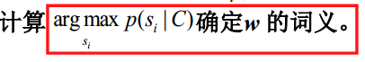| 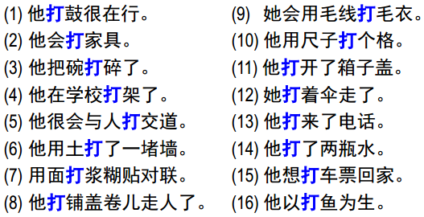 “打”的含义有多个，需要根据上下文确定“打”的含义,这里上下文指“打”前后的汉子|
| 贝叶斯公式 | 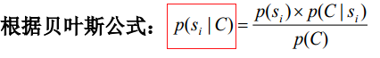 |   |
| 分母不变性，去掉公有项 | 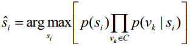 |   |
| 使用极大似然法进行估计 | 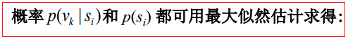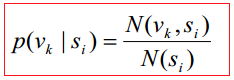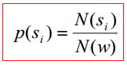 | N(si) 是在训练数据中词w用于义si时的次数，而N(vk, si)为w用于语义si时词vk出现在w的上下文中的次数。N(w)为多义词w在训练数据中出现的总次数。模型最后就是保存为这两个概率。|
| 歧义消解 |  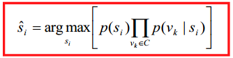 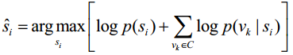  |  求最大的概率即可 |

## 2.举例
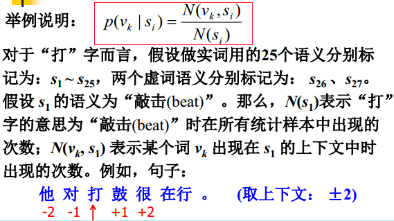 
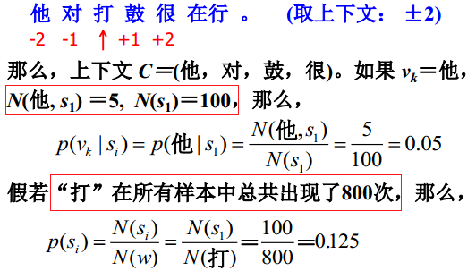 
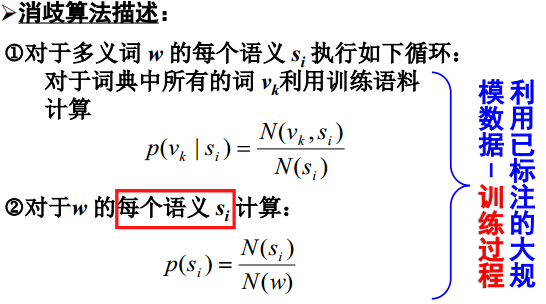 
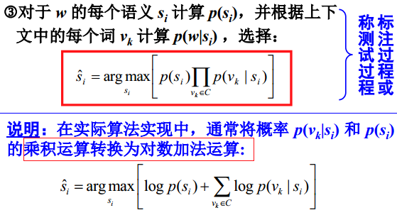
