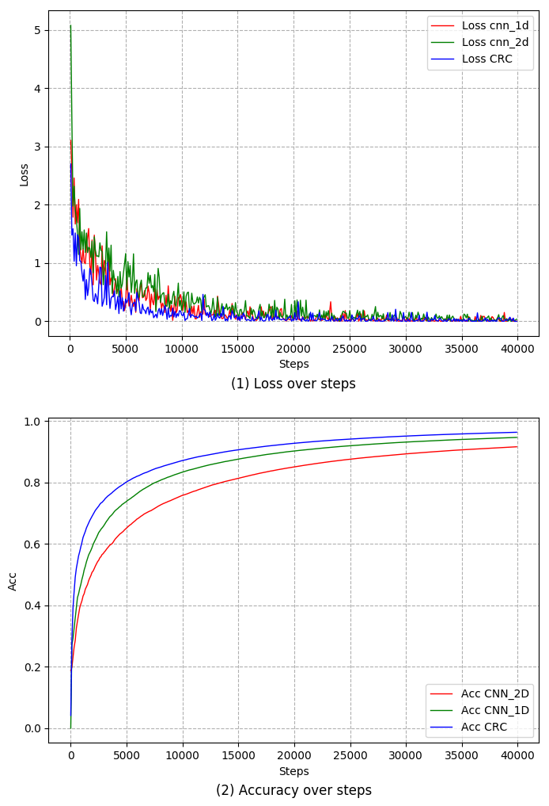
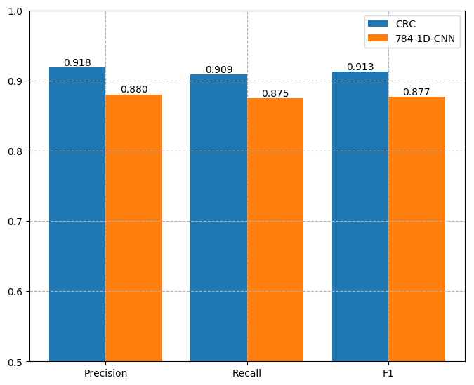
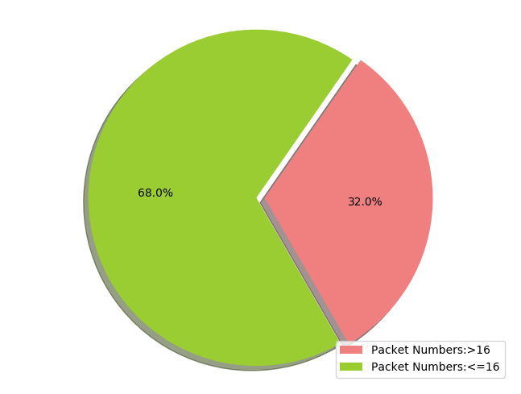
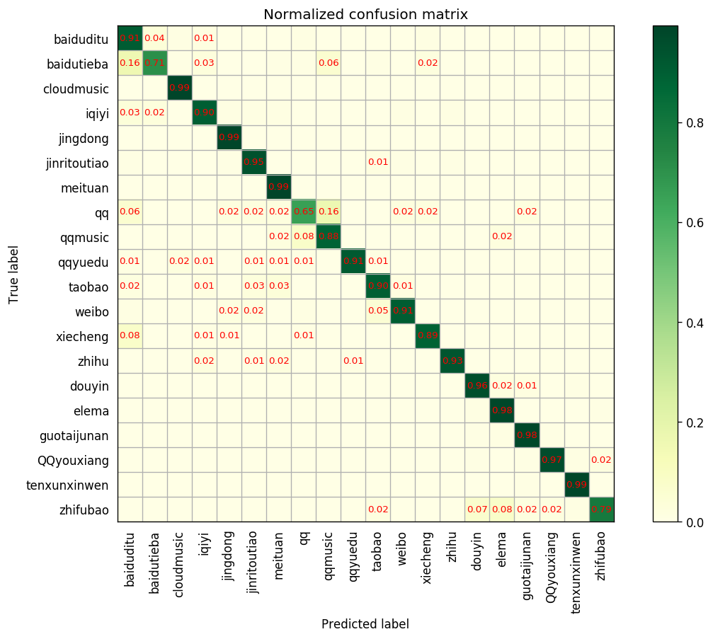

## 图像绘制基于matplotlib
#### 1.绘制曲线图
- 代码
```python
import pandas as pd
import numpy as np
import math
import matplotlib.pyplot as plt
loss_cnn1d=pd.read_csv("../../data/loss_cnn_1D.csv")
loss_cnn2d=pd.read_csv("../../data/loss_cnn_2d.csv")
loss_cnn1d_rnn=pd.read_csv("../../data/loss_cnn1d_rnn.csv")
loss_cnn1d_cnn1d_rnn=pd.read_csv("../../data/loss_cnn1d_cnn1d_rnn.csv")
loss_cnn1d_cnn1d=pd.read_csv("../../data/loss_cnn1d_cnn1d.csv")
x=loss_cnn1d["Step"][1:]
y1=loss_cnn1d["Value"][1:]
y2=loss_cnn2d["Value"][1:]
y3=loss_cnn1d_rnn["Value"][1:]
y4=loss_cnn1d_cnn1d_rnn["Value"][1:]
y5=loss_cnn1d_cnn1d["Value"][1:]
plt.rcParams['font.sans-serif']=['SimHei']
plt.rcParams['axes.unicode_minus'] = False
plt.figure(figsize=(8, 12))

ax=plt.subplot(211)

plt.xlabel("Steps")
plt.ylabel("Loss")
plt.plot(x, y1, 'r-', mec='k', label='Loss cnn_1d', lw=1)
plt.plot(x, y2, 'g-', mec='k', label='Loss cnn_2d', lw=1)
plt.plot(x, y3, 'b-',mec='k', label='Loss CRC', lw=1)
# plt.plot(x, y4, color='olive' ,linestyle='-', mec='k', label='Loss cnn1d_cnn1d_rnn', lw=1)
# plt.plot(x, y5, color='orange' ,linestyle='-', mec='k', label='Loss cnn1d_cnn1d', lw=1)
# plt.plot(x, boost, 'm--',mec='k', label='Adaboost Loss',lw=2)
plt.grid(True, ls='--')
plt.legend(loc='upper right')
plt.title('(1) Loss over steps',y=-0.18)
# plt.savefig('../result/loss.png')
# plt.show()


acc_cnn_2d=pd.read_csv("../../data/acc_cnn_2d.csv")
acc_cnn_1d=pd.read_csv("../../data/acc_cnn_1d.csv")
acc_cnn1d_rnn=pd.read_csv("../../data/acc_cnn1d_rnn.csv")
acc_cnn1d_cnn1d_rnn=pd.read_csv("../../data/acc_cnn1d_cnn1d_rnn.csv")
acc_cnn1d_cnn1d_rnn=pd.read_csv("../../data/acc_cnn1d_cnn1d_rnn.csv")
acc_cnn1d_cnn1d=pd.read_csv("../../data/acc_cnn1d_cnn1d.csv")

x_acc_cnn_2d=acc_cnn_2d["Step"]
y_acc_cnn_2d=acc_cnn_2d["Value"]
y_acc_cnn_1d=acc_cnn_1d["Value"]
y_acc_cnn1d_rnn=acc_cnn1d_rnn["Value"]
y_acc_cnn1d_cnn1d_rnn=acc_cnn1d_cnn1d_rnn["Value"]
y_acc_cnn1d_cnn1d=acc_cnn1d_cnn1d["Value"]
plt.subplot(212)
# plt.figure(figsize=(8, 5))
plt.xlabel("Steps")
plt.ylabel("Acc")
plt.plot(x_acc_cnn_2d, y_acc_cnn_2d, 'r-', mec='k', label='Acc CNN_2D', lw=1)
plt.plot(x_acc_cnn_2d,y_acc_cnn_1d, 'g-', mec='k', label='Acc CNN_1D', lw=1)
plt.plot(x_acc_cnn_2d, y_acc_cnn1d_rnn, 'b-',mec='k', label='Acc CRC', lw=1)
# plt.plot(x_acc_cnn_2d, y_acc_cnn1d_cnn1d_rnn,color='olive' ,linestyle='-',mec='k', label='Acc CNN1D_CNN1D_RNN', lw=1)
# plt.plot(x_acc_cnn_2d, y_acc_cnn1d_cnn1d,color='orange' ,linestyle='-',mec='k', label='Acc CNN1D_CNN1D', lw=1)


# plt.plot(x, boost, 'm--',mec='k', label='Adaboost Loss',lw=2)
plt.grid(True, ls='--')
plt.legend(loc='lower right')
plt.title('(2) Accuracy over steps',y=-0.18)
plt.subplots_adjust(hspace=0.25)
plt.savefig('../result/acc_loss.png',bbox_inches='tight')
plt.show()

```
- 效果

#### 2.绘制柱装图
- 代码
```
import numpy as np
import matplotlib.pyplot as plt
size = 3
mymodel = np.asarray([0.9184840801316903,0.9090443033011008,0.912511745951522])
baseline = np.asarray([0.88029597255012,0.8750779175862263,0.8768301416163474])


x = np.asarray([0,1,2])

total_width, n = 0.8, 2   # 有多少个类型，只需更改n即可
width = total_width / n
x = x - (total_width - width) / 2


plt.figure(figsize=(8, 6.5))
plt.grid(True, ls='--')
plt.ylim(0.5,1)
b1=plt.bar(x, mymodel,  width=width, label='CRC')
b2=plt.bar(x + width, baseline, width=width, label='784-1D-CNN')
plt.xticks(x+width/2,["Precision","Recall","F1"])
for b in b1+b2:
    h=b.get_height()
    plt.text(b.get_x()+b.get_width()/2,h,'%0.3f'%float(h),ha='center',va='bottom')

plt.legend()
plt.savefig("./test.png", format='png',bbox_inches='tight')
plt.show()
```
- 效果

#### 3.绘制饼装图
- 代码
```
import ast
import numpy as np
import pandas as pd
import matplotlib
import matplotlib.pyplot as plt
# 省略
labels = ['Packet Numbers:>16', 'Packet Numbers:<=16']
sizes = [count_higher_16,count_lower_16]
colors = ['lightcoral', 'yellowgreen']
explode = (0.05, 0)  # explode 1st slice
plt.figure(figsize=(8, 6))
# Plot
pie=plt.pie(sizes, colors=colors,autopct='%1.1f%%',explode=explode,shadow=True, startangle=300)
plt.legend(pie[0],labels, loc='lower right', fontsize=10)
plt.axis('equal')
# plt.tight_layout()
plt.savefig("./pkts_count.png", format='png',bbox_inches='tight')
plt.show()

```
- 效果

#### 4.绘制混淆矩阵
- 代码:输入true标签和predict标签自动计算并绘图
```
#/usr/bin/python env
#coding=utf-8
from sklearn.metrics import confusion_matrix
import matplotlib.pyplot as plt
import numpy as np

#绘制混淆矩阵
def plot_confusion_matrix(y_true, y_pred, labels, save_path,font_size=8):
    tick_marks = np.array(range(len(labels))) + 0.5
    # 配色:https://matplotlib.org/examples/color/colormaps_reference.html
    def plot(cm, title='Confusion Matrix', cmap=plt.cm.YlGn):
        plt.imshow(cm, interpolation='nearest', cmap=cmap)
        plt.title(title)
        plt.colorbar()
        xlocations = np.array(range(len(labels)))
        plt.xticks(xlocations, labels, rotation=90)
        plt.yticks(xlocations, labels)
        plt.ylabel('True label')
        plt.xlabel('Predicted label')


    cm = confusion_matrix(y_true, y_pred)
    np.set_printoptions(precision=2)
    cm_normalized = cm.astype('float') / cm.sum(axis=1)[:, np.newaxis]
    plt.figure(figsize=(10, 8), dpi=120)

    ind_array = np.arange(len(labels))
    x, y = np.meshgrid(ind_array, ind_array)

    for x_val, y_val in zip(x.flatten(), y.flatten()):
        c = cm_normalized[y_val][x_val]
        if c > 0.01:
            plt.text(x_val, y_val, "%0.2f" % (c,), color='red', fontsize=font_size, va='center', ha='center')
    # offset the tick
    plt.gca().set_xticks(tick_marks, minor=True)
    plt.gca().set_yticks(tick_marks, minor=True)
    plt.gca().xaxis.set_ticks_position('none')
    plt.gca().yaxis.set_ticks_position('none')
    plt.grid(True, which='minor', linestyle='-')
    plt.gcf().subplots_adjust(bottom=0.15)

    plot(cm_normalized, title='Normalized confusion matrix')
    # show confusion matrix
    plt.savefig(save_path+"_confusematrix.png", format='png',bbox_inches='tight')
    plt.show()
```
- 效果


